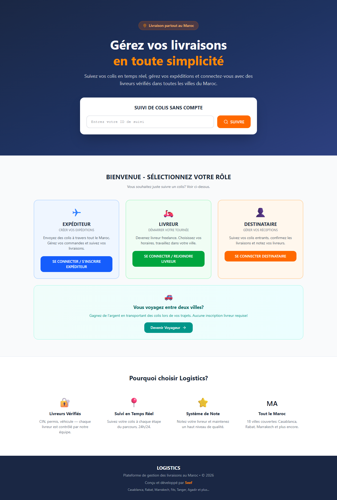
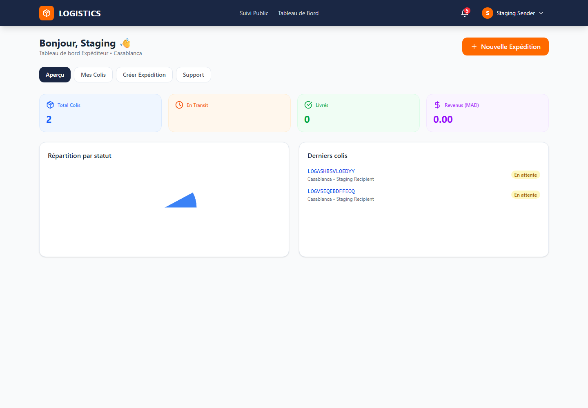
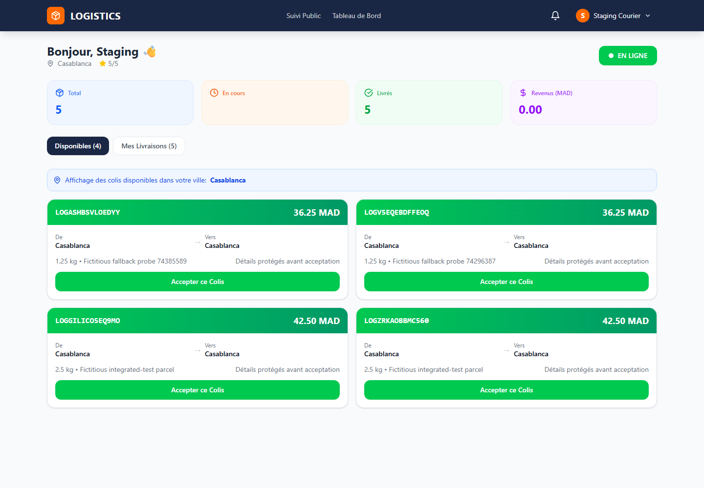

# Logistics School

Plateforme web de gestion des livraisons au Maroc, conçue et développée par [5eef](https://github.com/5eef).

Le projet réunit une SPA React, une API Laravel sécurisée, une base MySQL et des notifications temps réel. Il couvre le cycle complet d’un colis : création, tarification serveur, prise en charge, suivi, remise par PIN, notation et support.


## Aperçu du projet



| Tableau de bord expéditeur | Tableau de bord livreur |
|---|---|
|  |  |

Ces captures proviennent du staging Docker local avec des comptes et colis strictement fictifs. Pour les régénérer après une démonstration :

```powershell
Set-Location .\frontend
npm ci
Set-Location ..
powershell.exe -NoProfile -ExecutionPolicy Bypass -File .\scripts\capture-portfolio-screens.ps1
```

## Pourquoi ce projet

Logistics School démontre la conception d’un produit métier complet, au-delà d’une simple interface CRUD. Les règles sensibles sont contrôlées côté serveur et l’environnement Docker local reproduit une topologie proche de la production avec HTTPS, WebSocket, worker, scheduler, email de test et sauvegardes MySQL.

### Parcours couverts

- **Expéditeur** : créer une expédition, consulter le prix calculé par le serveur et suivre son historique.
- **Livreur** : passer en ligne, accepter une mission et faire progresser la livraison.
- **Destinataire** : suivre ses colis, confirmer la réception et noter le transporteur.
- **Voyageur** : proposer un trajet interville et transporter les colis compatibles.
- **Administrateur** : modérer les comptes, gérer les paiements et suivre les actions sensibles.
- **Visiteur** : suivre un colis publiquement sans exposer de donnée personnelle.

## Points techniques

- authentification SPA first-party avec Laravel Sanctum ;
- cookies `Secure`, session HttpOnly, CSRF et origines explicites ;
- notifications privées avec Laravel Reverb en WSS et repli par polling ;
- transitions d’état contrôlées et livraison finale uniquement par PIN ;
- tarification serveur et création idempotente ;
- queue et scheduler dédiés ;
- MySQL 8.4 persistant avec scripts de sauvegarde et restauration testée ;
- HTTPS local via Caddy et emails capturés par Mailpit ;
- tests PHPUnit, PHPStan, Pint, Vitest, ESLint et Playwright.

## Architecture

```text
Navigateur
   │ HTTPS / WSS
   ▼
Caddy ─────► React / Nginx
   │
   ├───────► Laravel / Apache ─────► MySQL
   │                  │
   │                  ├────────────► Queue worker
   │                  ├────────────► Scheduler
   │                  └────────────► Mailpit
   └───────► Laravel Reverb
```

| Couche | Technologies |
|---|---|
| Frontend | React 18, Vite, Tailwind CSS, Wouter, React Query, Recharts |
| Backend | PHP 8.4, Laravel 13, Sanctum, Eloquent, Reverb |
| Données | MySQL 8.4 |
| Infrastructure locale | Docker Compose, Caddy, Nginx, Mailpit |
| Qualité | PHPUnit, PHPStan, Pint, Vitest, ESLint, Playwright |

## Démarrage rapide avec Docker

Prérequis : Docker Desktop, PowerShell et les ports locaux 80/443 disponibles.

```powershell
git clone --branch deployment-ready https://github.com/5eef/logistics.git logistics-school
Set-Location .\logistics-school

powershell.exe -NoProfile -ExecutionPolicy Bypass -File .\scripts\init-staging.ps1
powershell.exe -NoProfile -ExecutionPolicy Bypass -File .\scripts\install-local-hosts.ps1
powershell.exe -NoProfile -ExecutionPolicy Bypass -File .\scripts\staging-up.ps1 -SeedTestData
```

Services locaux :

- application : `https://logistics.local` ;
- API : `https://api.logistics.local` ;
- boîte email de test : `https://mail.logistics.local`.

La procédure complète, notamment la confiance du certificat local, se trouve dans [docs/STAGING.md](docs/STAGING.md).

## Démonstration manuelle

Le mot de passe aléatoire des comptes fictifs est conservé uniquement dans `.env.staging` :

```powershell
Select-String "^STAGING_TEST_PASSWORD=" .env.staging
```

| Rôle | Compte fictif |
|---|---|
| Expéditeur | `staging.sender@example.test` |
| Livreur | `staging.courier@example.test` |
| Destinataire | `staging.recipient@example.test` |
| Voyageur | `staging.traveler@example.test` |
| Administrateur | `staging.admin@example.test` |

Scénario conseillé : créer un colis comme expéditeur, le prendre comme livreur dans une fenêtre privée, progresser jusqu’à la remise par PIN, puis le noter comme destinataire.

## Validation

```powershell
powershell.exe -NoProfile -ExecutionPolicy Bypass -File .\scripts\preflight.ps1 -Environment staging -RequireRunning -SkipTests
powershell.exe -NoProfile -ExecutionPolicy Bypass -File .\scripts\smoke-test.ps1
powershell.exe -NoProfile -ExecutionPolicy Bypass -File .\scripts\test-staging-e2e.ps1
```

Le smoke test vérifie HTTPS, CSRF, authentification, mutation protégée, MySQL, WSS et déconnexion. Le parcours Playwright valide le cycle métier réel jusqu’au PIN et à la notation.

## Structure

```text
frontend/       SPA React et tests navigateur
backend-new/    API Laravel, règles métier et tests
docker/         reverse proxy et modèles TLS
scripts/        exploitation, validation, backup et restauration
docs/           staging, opérations, audit et captures portfolio
```

## Statut

- **Code ready** : oui.
- **Staging local production-like** : oui.
- **Production distante** : non déployée ; les domaines publics, le TLS public, le SMTP réel, l’observabilité et les sauvegardes hors hôte restent à fournir.

## Auteur

**5eef** — [github.com/5eef](https://github.com/5eef)

## Licence

Distribué sous licence [MIT](LICENSE). Copyright © 2026 5eef.
